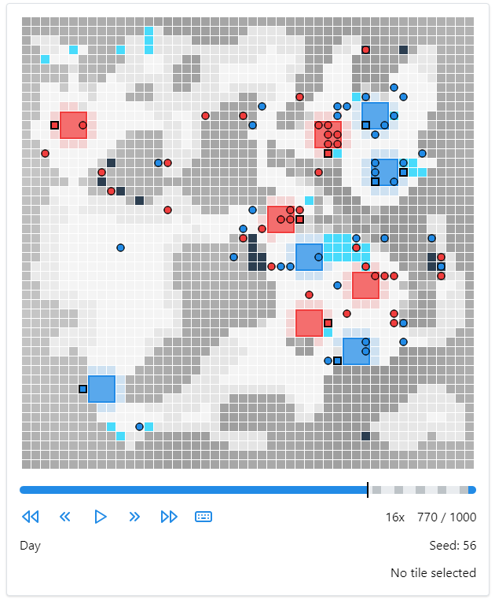

# Lux AI Season 2 Contribution

This repo contains my final codebase for the LUX AI Kaggle competition in which I
secured a bronze medal. Leaderboard: https://www.kaggle.com/competitions/lux-ai-season-2/leaderboard

## Caution: This code was developed under quite some time pressure

[Lux AI](https://www.kaggle.com/competitions/lux-ai-season-2/overview) is a 2-player strategy game
similar to starcraft designed to be played by computer programs. It involves the control of many
(potentially hundres) of units, managing of different resources and different game phases. The goal
of the game is to collect as many points in the form of lichen as possible.

I chose a rule base approach for this competition. A screenshot from an example match played by the bot against itself is shown
below, the full replay can be watched [here](./replay.html) (Unfortunately it is not displayed correctly by Github, you have to download 
the file separately and open it in the browser).

The large colorful blocks show factories, the small circles are the robots controlled by the players. The map is hilly with
darker fields indicating mountains and ligher fields indicating valleys. The two different raw resources of the game are shown in black for 
ore and medium turquoise for ice. The light red/blue shaded regions next to the factories are the lichen/points that can be grown from the factories.

